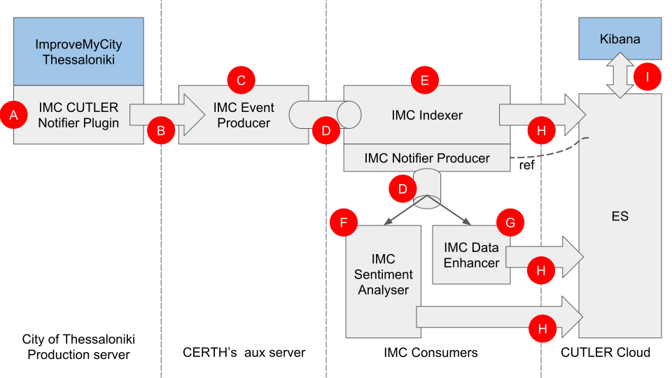

# IMC2Kibana
The purpose of this documentation is to explain how the data flows from the production server of ImproveMyCity (IMC) of the Municipality of Thessaloniki to Kibana for creating near real time visualisations.



Following CUTLER's guidelines towards system integration, IMC streams data via Kafka to ElasticSearch and consequently to Kibana through a set of Kafka Producers and Consumers.

Since this solution is applied to the production IMC server of the Municipality of Thessaloniki and in order to avoid consuming resources resources and assumption has been made (A, B, C).  
An extra layer, hosted in CERTH's auxiliary server is implemented in order to move Kafka producer (C) outside the city's production server. To achieve this, the IMC CUTLER Notifier Plugin (A) tracks and sends IMC events (such as 'new issue', 'issue updated', 'issue under moderation', etc) via JSON (B) to the **Node.js** based module (C). The main code of (C) is [available in the repository](#). (C) is the main IMC producer which streams IMC data to Kafka broker(s) (D). 

IMC Event Producer (C) uses the following Kafka topics to stream data:

* ``THESS_IMC_ISSUE_CREATED``
* ``THESS_IMC_ISSUE_UPDATED``
* ``THESS_IMC_ISSUE_DELETED``
* ``THESS_IMC_ISSUE_MODERATED``
* ``THESS_IMC_ISSUE_UNMODERATED``
* ``THESS_IMC_ISSUE_VOTED ``
* ``THESS_IMC_ISSUE_STATUS_UPDATED``
* ``THESS_IMC_COMMENT_CREATED``
* ``THESS_IMC_COMMENT_DELETED``

> A topic is a stream name to which records are published. Topics in Kafka are always multi-subscriber; that is, a topic can have zero, one, or many consumers that subscribe to the data written to it.

A set of IMC consumers are implemented to consume the streamed IMC data. The main IMC Kafka Consumer (*which is also a Producer*) is the IMC Indexer (E). Its main job is to index the incoming streamed IMC data to the ElasticSearch. Currently, IMC Indexer (E) transforms the JSON based IMC data to JSONNP and uses POST CURL to push the data to ElasticSearch (H). The next step (in order to avoid the manual data transformation) is to use Logstash with proper configuration.

Besides, indexing data to ElasticSearch, IMC Indexer (E) also acts as Kafka Producer Notifier which produce a single record in the topic ``IMC_DATA_INDEXED`` that contains a **reference** to the indexed data in ElasticSearch. Actually, it notifies to whom it may concern, that new processed data are available in ElasticSearch. The **reference** is composed of the _id and the name of the topic that triggered the indexing and send to Kafka Stream (D). For example:

```
{ 
    "_id": 44905, 
    "triggered_by": "IMC_COMMENT_CREATED",
    "ts": 1555015207 
}
```

Currently, two consumers, namely; IMC Sentiment Analyser (F) and IMC Data Enhancer (G) consumes the ``IMC_DATA_INDEXED`` topic.

IMC Sentiment Analyser (F) reads from the ElasticSearch, e.g.  
``curl -X GET "localhost:9200/imc/_doc/44905"``  
and applies its algorithm to any of the text fields; "title", "description", "comment" and push the result (H) to ElasticSearch (updates the document)

IMC Data Enhancer (G) reads from the ElasticSearch, e.g.  
``curl -X GET "localhost:9200/imc/_doc/44905"``  
and applies its algorithm based on the location (lat, lng) and push the result (H) to ElasticSearch (updates the document)

Finally, Kibana visualisations are automatically updated since it is interlinked with the ElasticSearch via REST API (I).
